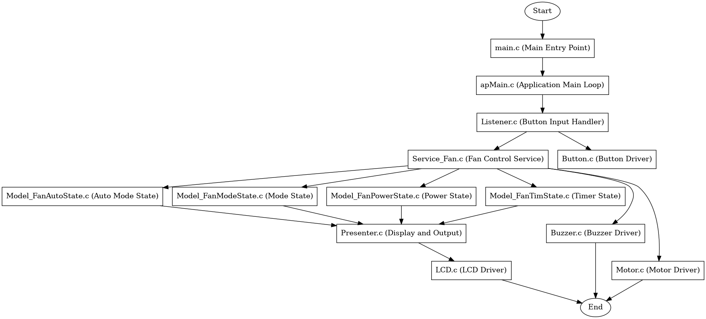

## 💨 ATmega128 Fan Control Project

---

## 📁 프로젝트 간략 소개
- **ATmega128** 기반으로 팬 속도와 작동을 다양한 입력 조건과 사용자 제어에 따라 관리하는 시스템 구현.
- 실시간 기능 및 안전성을 갖춘 팬 제어 시스템으로 다양한 상황에 대응 가능.

---

## 💻 프로젝트 내용

### 🎯 목적
- 사용자의 환경 및 조건에 맞게 팬 속도를 조절하고, 안전성과 실시간 모니터링 기능을 제공하는 스마트 팬 시스템 구현.

### 🎣 목표
- a. **PWM**을 활용하여 팬 속도를 정밀하게 제어.
- b. **온도 센서**와 연동하여 자동으로 팬 속도를 조정.
- c. LCD를 통해 실시간으로 팬 상태 및 경고 메시지를 표시.
- d. 안전 기능(과전류, 과열 보호)을 통해 시스템의 안정성을 강화.
- e. 에러 발생 시 EEPROM에 로그 저장.

---

## 🔄 주요 기능

1. **팬 속도 제어**:
   - **PWM**을 사용하여 팬 속도를 정밀하게 조정.
   - 다양한 속도 레벨을 지원하여 냉각 요구에 맞게 설정 가능.

2. **버튼 제어**:
   - **Start/Stop 버튼**: 팬의 전원을 켜거나 끔.
   - **속도 조정 버튼**: 팬 속도를 증가 또는 감소.
   - **긴급 정지 버튼**: 안전을 위해 팬을 즉시 정지.

3. **LCD 디스플레이**:
   - 팬 상태, 속도 레벨, 작동 모드를 **16x2 LCD**에 표시.
   - 실시간으로 변경 사항을 업데이트.

4. **실시간 모니터링**:
   - 팬 작동 상태 및 시스템 상태를 지속적으로 모니터링.
   - 경고 또는 오류 메시지(예: 과전류, 과열)를 표시하여 안전성 보장.

5. **온도 기반 제어**:
   - **온도 센서**와 연동하여 주변 온도에 따라 팬 속도를 자동으로 조절.

6. **안전 기능**:
   - **과전류 보호**: 과도한 전류를 감지하여 팬을 종료.
   - **과열 보호**: 시스템 온도를 모니터링하여 과열 시 팬 정지.

7. **전력 효율성**:
   - 대기 상태나 저속 작동 시 전력 소비 최적화.

8. **모듈화된 코드 구조**:
   - 추가 기능 및 센서 통합을 쉽게 확장 가능.

9. **에러 로그 기록**:
   - 과전류, 과열 등의 에러를 **EEPROM**에 저장하여 추후 진단 가능.

10. **원격 제어 지원**:
    - **Bluetooth** 또는 **IR 리모컨**을 통해 무선으로 팬을 조정 가능.

11. **타이머 기능**:
    - 설정된 시간 후 팬이 자동으로 종료.

12. **LED 인디케이터**:
    - 저속, 중속, 고속 등 팬 모드를 나타내는 **LED** 사용.

---

## 🗂️ 파일 구성

```
Fan_Project/
|
├── ap/                    # 애플리케이션 코드
├── driver/                # 주변 장치 드라이버 코드
├── periph/                # 주변 장치 제어 코드
├── main.c                 # 메인 소스 파일
├── Fan_Project.cproj      # 프로젝트 구성 파일
└── Fan_Project.atsln      # Atmel Studio 솔루션 파일
```

---

## 🛠️ 기술 스택

### **하드웨어**
- **ATmega128 마이크로컨트롤러**
- **DC 팬**
- **16x2 LCD 디스플레이**
- **푸시 버튼** (속도 및 전원 제어용)
- **PWM 제어 회로**
- **온도 센서** (온도 기반 제어)
- **EEPROM** (에러 로그 저장)
- **Bluetooth/IR 모듈** (원격 제어용)
- **LED 인디케이터**
- **전원 공급 장치**

### **소프트웨어**
- **프로그래밍 언어**: C
- **IDE**: Atmel Studio
- **라이브러리 및 툴**: AVR libc, EEPROM 라이브러리

---

## 📊 시스템 구성도



---

## 📖 설치 및 설정

1. **리포지토리 클론**:
   ```bash
   git clone https://github.com/Kwonsiwoo2/Fan-Project
   cd Fan-Project
   ```

2. **Atmel Studio에서 프로젝트 열기**:
   - `Fan_Project.atsln` 파일을 열어 프로젝트를 불러옵니다.

3. **컴파일 및 업로드**:
   - 프로젝트를 컴파일하고 생성된 hex 파일을 ATmega128에 업로드.

4. **하드웨어 연결**:
   - 팬, 버튼, LCD, 온도 센서 및 기타 주변 장치를 회로도에 따라 연결.

---

## 🛠️ 주요 코드 스니펫

**PWM 기반 팬 속도 제어 (`main.c`)**:

```c
#include <avr/io.h>

void pwm_init() {
    // PWM 모드 및 분주 설정
    TCCR0 = (1 << WGM00) | (1 << WGM01) | (1 << COM01) | (1 << CS01);
    DDRB |= (1 << PB3); // PB3를 PWM 출력으로 설정
}

void set_fan_speed(uint8_t speed) {
    OCR0 = speed; // PWM 듀티 사이클 설정
}

int main() {
    pwm_init();
    while (1) {
        set_fan_speed(128); // 팬 속도를 50%로 설정 (예제)
    }
}
```

---

## 📊 사용 방법

1. **시스템 전원 켜기**.
2. **Start/Stop 버튼**으로 팬을 켜거나 끕니다.
3. **속도 조정 버튼**으로 팬 속도를 증가 또는 감소.
4. **LCD 디스플레이**에서 팬 상태를 모니터링.
5. 오류 발생 시 경고 메시지가 표시되며 팬이 정지합니다.
6. (원격 제어 기능 활성화 시) Bluetooth 또는 IR 리모컨으로 팬을 제어.

---

## 🌟 기여 방법
기여를 환영합니다! 문제 제기나 Pull Request를 자유롭게 제출하세요.

---

### 👇 Connect with Me

[](https://github.com/Kwonsiwoo2)  [](https://www.linkedin.com/in/%EC%8B%9C%EC%9A%B0-%EA%B6%8C-064765341/)

