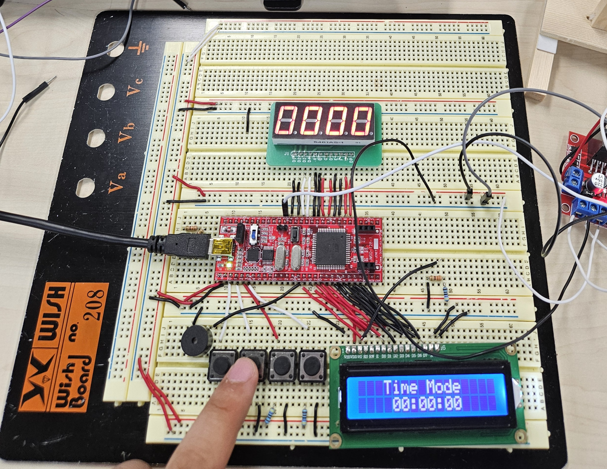
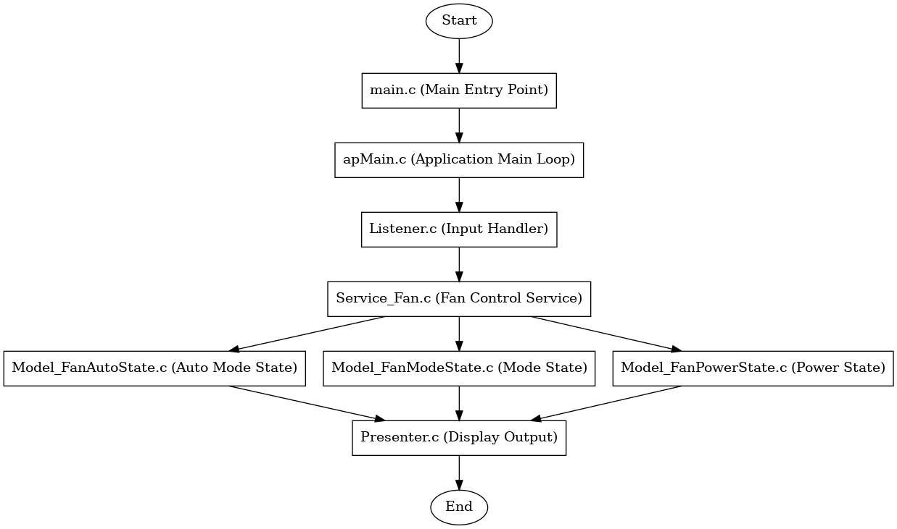

## 💨 ATmega128 Fan Control Project

This project uses an **ATmega128 microcontroller** to implement a fan control system. The system manages fan speed and operation based on various input conditions and user controls. It includes peripheral drivers, application logic, and real-time functionality.

---

### 🔄 Features

1. **Fan Speed Control**:
   - Control fan speed using **Pulse Width Modulation (PWM)** for precise adjustments.
   - Supports multiple speed levels to suit different cooling needs.

2. **Button Controls**:
   - **Start/Stop Button**: Turn the fan on or off.
   - **Speed Adjustment Buttons**: Increase or decrease fan speed incrementally.
   - **Emergency Stop Button**: Immediately stop the fan for safety purposes.

3. **LCD Display**:
   - Display current fan status, speed level, and operating mode on a **16x2 LCD screen**.
   - Real-time updates provide immediate feedback on any changes.

4. **Real-Time Monitoring**:
   - Continuously monitor fan operation and system status.
   - Display warnings or error messages (e.g., overcurrent detection, overheating) to ensure safe operation.

5. **Temperature-Based Control**:
   - Automatically adjust fan speed based on ambient temperature readings.
   - Integrates with temperature sensors to provide dynamic cooling.

6. **Safety Features**:
   - **Overcurrent Protection**: Detects excessive current and shuts down the fan to prevent damage.
   - **Overheat Protection**: Monitors system temperature and stops the fan if overheating occurs.

7. **Power Efficiency**:
   - Optimized for low power consumption when idle or running at lower speeds.

8. **Modular Code Structure**:
   - Easy to expand and modify for additional features or sensor integrations.

9. **Error Logging**:
   - Log errors such as overcurrent and overheating to **EEPROM** for later diagnostics.

10. **Remote Control Support**:
    - Add support for controlling the fan via **Bluetooth** or **IR remote** for wireless adjustments.

11. **Timer Functionality**:
    - Automatically turn off the fan after a set duration using a timer feature.

12. **LED Indicators**:
    - Use **LEDs** to indicate different fan modes (e.g., Low, Medium, High).

---
## 🖼️ Project Images

### Real-Time Monitoring Display

  

---

## 📊 System Architecture Diagram

### Diagram Overview



---

### 🛠️ Hardware Used

- **ATmega128 Microcontroller**
- **DC Fan**
- **16x2 LCD Display**
- **Push Buttons** (for controlling fan speed and power)
- **PWM Control Circuit**
- **Temperature Sensor** (for temperature-based control)
- **EEPROM** (for error logging)
- **Bluetooth/IR Module** (for remote control)
- **LED Indicators**
- **Power Supply**

---

### 📖 Installation and Setup

1. **Clone the Repository**:
   ```bash
   git clone https://github.com/yourusername/atmega128-fan-project.git
   cd atmega128-fan-project
   ```

2. **Open the Project in AVR Studio/Atmel Studio**:
   - Open `Fan_Project.atsln` in Atmel Studio.

3. **Compile and Upload**:
   - Compile the project and upload the hex file to the ATmega128 microcontroller.

4. **Hardware Connections**:
   - Connect the fan, buttons, LCD, temperature sensor, and other peripherals according to the circuit diagram.

---

### 📚 Project Structure

```
Fan_Project/
|
├── ap/                    # Application code
├── driver/                # Driver code for peripherals
├── periph/                # Peripheral control code
├── main.c                 # Main source file
├── Fan_Project.cproj      # Project configuration file
└── Fan_Project.atsln      # Atmel Studio solution file
```

---

### 🛠️ Key Code Snippets

**Fan Speed Control (PWM) in `main.c`**:

```c
#include <avr/io.h>

void pwm_init() {
    // Set PWM mode and prescaler
    TCCR0 = (1 << WGM00) | (1 << WGM01) | (1 << COM01) | (1 << CS01);
    DDRB |= (1 << PB3); // Set PB3 as output for PWM
}

void set_fan_speed(uint8_t speed) {
    OCR0 = speed; // Set PWM duty cycle
}

int main() {
    pwm_init();
    while (1) {
        set_fan_speed(128); // Example: Set fan speed to 50%
    }
}
```

---

### 📊 Usage Instructions

1. **Power On** the system.
2. Use the **Start/Stop Button** to turn the fan on or off.
3. Adjust fan speed with the **Speed Adjustment Buttons**.
4. Monitor fan status on the **LCD Display**.
5. If an error occurs (e.g., overheating), the system will display a warning and stop the fan.
6. Use the **Remote Control** (if enabled) for wireless operation.

---

### 🌟 Contributing

Contributions are welcome! Feel free to submit issues or pull requests.

---

### 👇 Let's Connect!

[](https://github.com/Kwonsiwoo2)  [](https://www.linkedin.com/in/%EC%8B%9C%EC%9A%B0-%EA%B6%8C-064765341/)

